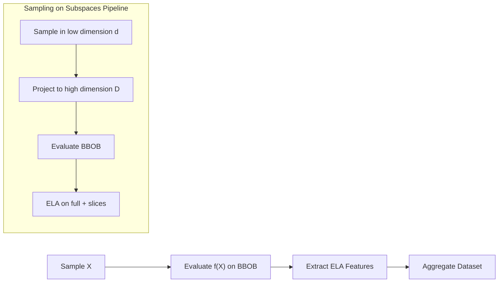

# BBOB Sampling & ELA Feature Extraction Pipeline


A scalable, end-to-end pipeline for:

- Sampling continuous search spaces  
- Evaluating **BBOB benchmark functions**  
- Extracting **ELA (Exploratory Landscape Analysis)** features  
- Studying **compression ratio effects** on sampling on random subspaces  
- Building large datasets efficiently (parallel + chunked)

---

# Full Pipeline Overview



# Project Structure
```
.
├── doe_sampling.py                      # Generate X samples
├── y_sampling.py                        # Evaluate BBOB functions
├── ela_sampling.py                      # Extract ELA features
├── sampler.py                           # Alternative IOH-based sampling
│
├── slicing_sampling_test_parallel.py
├── slicing_all_in_sampling_test_parallel.py
│   └── Low-D → High-D sampling + parallel ELA
│
├── parallel_loader.py                   # Build final dataset (chunked)
├── parallel_loader_slices.py
├── parallel_loader_slices_all_in.py
│   └── Parallel loading of many CSV files
│
└── data/                                # Outputs (generated)
```

# Installation
Just run the following line in *bash*:
```
python3 -m pip install -r requirements.txt
```

# Usage (End-to-End)
## Generate Samples for Full-Space Sampling on BBOB
The following is an example to use any Quasi-Monte-Carlo sampling. Currently, the code allows to use `halton`, `sobol` or `lhs` to generate points to be then passed to one of the BBOB functions and get function evaluations for ulterior assessment.

### Example
```
python doe_sampling.py \
    --dim 20 \
    --n 1000 \
    --sampler lhs \
    --seed 42 \
    --out samples.csv

```

### Output
As an output, a folder is generated with the corresponding dimension, number of samples $n$, the utilized qmc-sampler, the random seed set as in:
```
x_samples/
  reduction/
    Dimension_20/
      seed_42/
        Samples_1000/
          samples.csv
```

## Evaluation of BBOB Functions
Run:
```
python y_sampling.py
```

Where you need to open the file and select the folder with the already generated samples. By running the script correctly, then the following directories will be generated:
```
bbob_evaluations/
  reduction/
    Dimension_20/
      seed_42/
        Samples_1000/
          f_1/
            id_0/
              evaluations.csv
```
The script `y_sampling.py` has predefined to evaluate the 24 functions from the BBOB and the first 15 instances of each function.

### Extract ELA features
Run:
```
python ela_sampling.py
```

Therein you have to indicate the directories with the samples and the corresponding evaluations.

Then the output is the following:
```
ela_features/
  reduction/
    Dimension_20/
      seed_42/
        Samples_1000/
          f_1/
            id_0/
              ela_features.csv
```

Each file contains:
```
feature_1, feature_2, ..., feature_n
```

### Building Final Dataset
Run:
```
python parallel_loader.py
```

The latter script generates the files:
```
complete_data_generated.csv
complete_data_generated.parquet
```

